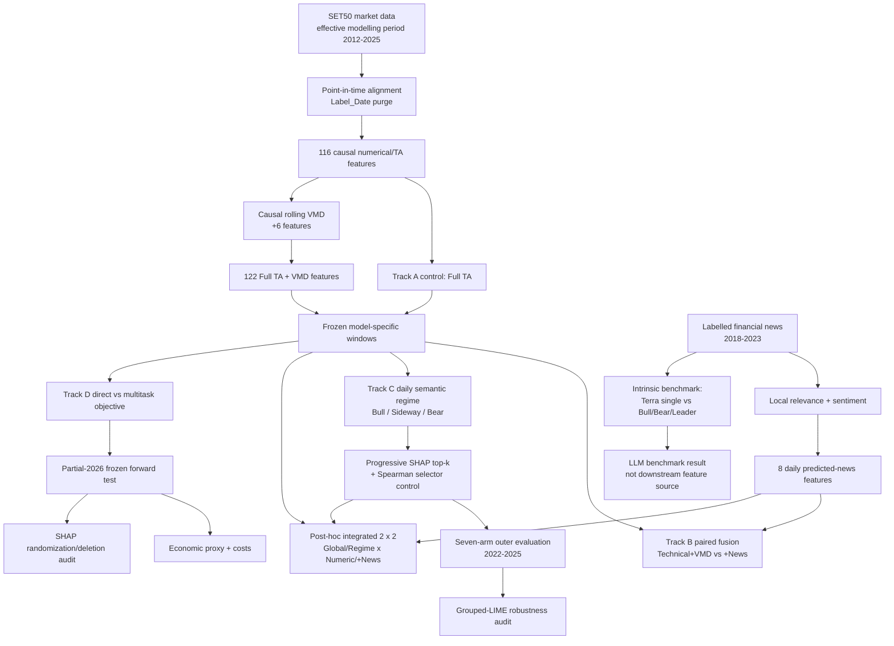

# สรุป Pipeline งานวิจัย SET50 สำหรับให้อาจารย์ประเมินระดับวารสาร

สถานะเอกสาร: **Pre-manuscript assessment package**  
วันที่สรุป: 1 สิงหาคม 2026  
ขอบเขต: สรุปสิ่งที่ดำเนินการจริง ผล corrected ล่าสุด และข้อจำกัดสำหรับประเมินความเหมาะสมต่อวารสาร  
สถานะ manuscript: **ยังไม่ได้เริ่มเขียน paper จากเอกสารนี้**

## ข้อมูลวารสารเป้าหมายสำหรับอาจารย์กรอก

| รายการ | ข้อมูล |
|---|---|
| ชื่อวารสารเป้าหมาย | ........................................................ |
| Publisher / Database | ........................................................ |
| Subject category | ........................................................ |
| Quartile และปีที่ใช้อ้างอิง | ........................................................ |
| Article type | Research article / Methodological study / Applied AI study / อื่น ๆ |
| ข้อสรุปของอาจารย์ | Q1 / Q2 / Q3 / Q4 / ยังไม่เหมาะส่ง |

> หมายเหตุ: Quartile เปลี่ยนตามฐานข้อมูล หมวดวิชา และปี จึงควรระบุชื่อวารสาร ฐานข้อมูล และปีให้ชัดก่อนตัดสินระดับสุดท้าย

## 1. Executive summary

งานนี้ศึกษาการทำนายทิศทางดัชนี SET50 วันซื้อขายถัดไป โดยใช้ข้อมูลที่ทราบได้ถึงเวลาปิดตลาดวัน (t) เพื่อทำนายว่าราคาปิดวัน (t+1) จะสูงหรือต่ำกว่าวัน (t) งานใช้โมเดลเดิมห้า architecture ได้แก่ LSTM, CNN, LSTM-CNN, LSTM-Attention และ LSTM-CNN-Attention พร้อมการประเมินแบบ expanding temporal folds, five random seeds, point-in-time label purge และการเก็บ runtime/metadata/hash สำหรับตรวจสอบย้อนหลัง

งานประกอบด้วยสี่โมดูลการทดลองใน paper เดียว:

1. **Numerical denoising:** เปรียบเทียบ Full Technical Analysis กับ Full TA + causal rolling VMD
2. **News and LLM sentiment:** เปรียบเทียบ local NLP, LLM single pass, Bull/Bear/Leader debate และผลของ predicted-news features ต่อโมเดลทั้งห้า
3. **Market regime and explainability:** สร้าง Bull/Sideway/Bear router รายวัน แล้วประเมิน progressive SHAP, Spearman control, capacity-matched control และ grouped LIME
4. **Forward robustness:** เปลี่ยน objective เป็น direct direction classification และ direction/return multitask แล้วทดสอบกับ partial-2026 forward data พร้อม transaction-cost proxy และ SHAP sanity tests

ผลโดยรวมเป็น **mixed/negative evidence** มากกว่าผลชนะอย่างสม่ำเสมอ:

- VMD เพิ่ม Balanced Accuracy เฉพาะ LSTM-CNN และผลไม่ significant
- Standalone Track B news fusion เพิ่ม Balanced Accuracy ใน LSTM และ LSTM-Attention แต่ไม่เพิ่มอีกสาม architecture
- Post-hoc integrated news + Regime-SHAP เพิ่ม BAcc ภายใน router เพียง LSTM (+0.13 pp) และ LSTM-Attention (+1.03 pp); ไม่มี contrast ใดผ่าน Holm correction
- Regime-SHAP ให้ Balanced Accuracy สูงสุด 54.53% ใน CNN แต่ไม่มี primary comparison ใดผ่าน Holm correction
- LLM debate ดีกว่า LLM single pass อย่างมีนัยสำคัญ แต่ยังด้อยกว่า local character TF-IDF
- Partial-2026 พบ weak discrimination และ model collapse ในหลาย architecture
- ผลเศรษฐศาสตร์ที่ดีที่สุดยังเป็น exploratory และ Deflated-Sharpe probability ต่ำกว่า 0.50

ดังนั้น contribution ที่ป้องกันได้ดีที่สุดไม่ใช่ “โมเดลใหม่ที่แม่นที่สุด” แต่เป็น **leakage-audited, point-in-time, multimodal and regime-aware reliability study** ที่แสดงทั้งผลบวก ผลผสม และ failure modes อย่างโปร่งใส

## 2. สิ่งที่รันจริง: dependency graph ของการทดลอง



### 2.1 ข้อจำกัดด้าน integration ที่ต้องระบุ

ข้อกังขาเดิมที่ว่า “ข่าวไม่ได้เข้า final forecasting model” ถูกแก้ด้วยการรัน **post-hoc integrated 2 x 2 extension** จริงแล้ว:

- Track A เป็นฐานสำหรับเลือก window และประเมิน VMD
- Track B นำ window จาก Track A ไปทดสอบ predicted-news fusion แยกต่างหาก
- Integrated extension ใช้ common cohort เริ่มปี 2019 และเปรียบเทียบ Global/Regime-SHAP x Numeric/+News ครบห้าโมเดล สี่ temporal folds และห้า seeds
- Frozen SHAP ยังคัดเฉพาะ numerical features; 8 news features ถูกเพิ่มเป็น mandatory modality block โดยไม่เลือกใหม่จาก outer outcomes
- Track D ใช้ 122 numerical/VMD features และ frozen windows แต่ **ไม่ได้ใช้ Track C Regime-SHAP arm เป็น final deployed model**
- Track C และ Track D มี XAI คนละวัตถุประสงค์: Track C ใช้เพื่อ feature selection/robustness ส่วน Track D ใช้ sanity and deletion audit บน direct classifiers

ดังนั้นงานมี executed integrated multimodal forecasting arm สำหรับปี 2019-2025 แล้ว แต่ยังไม่ควรเรียกว่า **fully integrated live/deployed trading pipeline** เพราะ Track D partial-2026 ไม่มี frozen 2026 news features, integrated extension เป็น post-hoc และยังไม่มี live execution

## 3. Prediction contract และการป้องกัน leakage

### 3.1 หน่วยการพยากรณ์

- หนึ่ง observation คือหนึ่งวันซื้อขาย (t)
- Input ใช้ข้อมูลที่ทราบได้เมื่อสิ้นสุดวัน (t)
- Tracks A-C ทำนาย `Target_Next_Close` แล้วแปลงเป็นทิศทางจากเครื่องหมายของ `Predicted_Close[t+1] - Close[t]`
- Track D ทำนาย Up probability โดยตรง และมี multitask return head เป็นการทดลองคู่ขนาน
- Actual zero-return rows เก็บไว้ใน regression แต่ตัดออกจาก binary DA/BAcc/MCC
- Predicted exact zero-change ถือเป็น abstention และรายงาน direction coverage

### 3.2 Point-in-time v2 correction

การตรวจ reviewer-risk พบว่า fold รุ่นเดิมมีหนึ่ง boundary label ต่อ fold ซึ่ง label date ข้ามเข้า evaluation period จึงแก้ไขและรันผลที่ได้รับผลกระทบใหม่ทั้งหมด กฎ authoritative ปัจจุบันคือ:

```text
เก็บ training observation เฉพาะเมื่อ
Label_Date < min(Date ของ evaluation split)
```

Feature row สุดท้ายก่อน test ยังคงใช้เป็น sequence context ได้ แต่ห้ามใช้เป็น supervised training sample, target หรือ scaler-fit row ทุก fold เก็บ `context_before_test.csv` แยก และตรวจ scaling reconstruction ได้ maximum error (2.22\times10^{-16})

ผลและโฟลเดอร์ที่ไม่มีคำว่า `point-in-time-v2` ก่อนการแก้ไขไม่ใช่ authoritative result สำหรับ Track A/B

### 3.3 Temporal split

Window selection ใช้เฉพาะข้อมูลก่อน outer test:

| Selection fold | Training | Validation |
|---|---|---:|
| 1 | 2012-2017 | 2018 |
| 2 | 2012-2018 | 2019 |
| 3 | 2012-2019 | 2020 |
| 4 | 2012-2020 | 2021 |

Outer evaluation:

| Outer fold | Training | Test | Test rows |
|---|---|---:|---:|
| 1 | 2012-2021 | 2022 | 241 |
| 2 | 2012-2022 | 2023 | 243 |
| 3 | 2012-2023 | 2024 | 244 |
| 4 | 2012-2024 | partial 2025 | 234 |

รวม outer-test 962 วันซื้อขาย เมล็ดสุ่มที่ใช้คือ 42, 123, 456, 789 และ 2025 โดย seed เป็น repeated fits ไม่ใช่ independent market samples

## 4. ข้อมูลและ feature engineering

### 4.1 Numerical data

Effective feature period เริ่ม 3 พฤษภาคม 2012 หลังหัก rolling warm-up และสิ้นสุด 18 ธันวาคม 2025 ในชุด outer evaluation

Full TA มี 116 model features แบ่งเป็น:

- Daily/previous-completed-week/previous-completed-month OHLCV
- Price, volume และ percentage-change lags
- Returns ระยะ 1, 3, 5, 10, 20 และ 60 วัน
- SMA, WMA, close-to-average ratios
- Rolling volatility, momentum และ rate of change
- Cross-timeframe price/volume ratios
- Candlestick body, shadow, spread และ close position
- Volume moving averages, ratios และ changes
- Direction lags, Up/Down ratios
- Stochastic, RSI, MACD, Williams %R, CCI, ADX และ directional indicators

Weekly และ monthly fields ใช้เฉพาะสัปดาห์/เดือนที่ปิดครบก่อนวัน (t) ไม่ใช้ค่าปลายงวดที่ยังไม่เกิดขึ้น

### 4.2 Causal rolling VMD

เพิ่ม feature จำนวน 6 ตัว รวมเป็น 122 features:

- `VMD_IMF_1` ถึง `VMD_IMF_4`
- `VMD_Denoised_Close`
- `VMD_Noise_Energy_Ratio`

การตั้งค่า:

| Parameter | Value |
|---|---:|
| Rolling history | 60 trading days |
| Number of modes | 5 |
| Alpha | 1000 |
| Tau | 0 |
| DC mode | enabled |
| Tolerance | `1e-7` |
| Maximum iterations | 500 |

แต่ละแถววัน (t) ใช้เฉพาะข้อมูล (t-59\ldots t) และตัด mode ที่มี final center frequency สูงสุดออกจาก denoised close

### 4.3 News data boundary

ชุด labelled หลักคือ Bilingual StockTBSA:

| รายการ | จำนวน/ช่วงเวลา |
|---|---:|
| Period | 2018-01-03 ถึง 2023-12-28 |
| Articles | 10,295 |
| Article-ticker labels | 15,949 |
| Valid positive/neutral/negative pairs | 12,706 |
| Locked 2023 test pairs | 1,333 |
| Unique articles ใน locked test | 738 |

ข้อมูลเสริม:

- CMDF-VISTEC/Kaohoon 2015-2017 มี 68,514 rows แต่ไม่มี sentiment/ticker labels จึงไม่ผสมกับ primary benchmark
- Official SET headlines 2024-2025 มี 69,824 deduplicated headlines
- 4,619 article-symbol pairs ผ่าน point-in-time SET50 membership filter
- 2012-2014 ยังไม่มี free source ที่สม่ำเสมอและตรวจวันเผยแพร่ได้เพียงพอ
- Accuracy ของ sentiment ปี 2024-2025 ไม่ทราบ เพราะไม่มี gold labels ชุดเดียวกับ 2018-2023

ข่าวที่ไม่มีเวลาเผยแพร่ถูกเลื่อนไปวันซื้อขายถัดไปแบบ conservative; ข่าววันหยุดไปวันซื้อขายถัดไป Eight daily features คือ:

```text
news_sentiment_mean
news_sentiment_std
positive_ratio
negative_ratio
neutral_ratio
article_count
ticker_mention_count
news_available
```

## 5. โมเดลทั้งห้าและ frozen windows

| Model | Architecture ย่อ | Frozen W | Track D direct parameters |
|---|---|---:|---:|
| LSTM | LSTM(16) -> Dense(8) -> output | 5 | 9,041 |
| CNN | causal Conv1D(32, k=3) -> GAP -> Dense(8) -> output | 20 | 12,017 |
| LSTM-CNN | LSTM(16, sequences) -> causal Conv1D -> GAP -> Dense | 20 | 10,737 |
| LSTM-Attention | LSTM(16, sequences) -> causal MHA(2 heads, key dim 8) -> GAP -> Dense | 10 | 10,129 |
| LSTM-CNN-Attention | LSTM -> causal Conv1D -> causal MHA -> GAP -> Dense | 20 | 12,865 |

Tracks A-C ใช้ 20 epochs, batch size 32, Adam, MSE, linear next-close output และ `shuffle=False` ส่วน Track D ใช้:

- `direct`: sigmoid Up probability + binary cross-entropy
- `multitask`: sigmoid direction head + standardized log-return head โดย loss weights เท่ากับ 1.0 และ 0.25

ไม่มี Optuna ใน final registered pipeline และไม่มีการเปลี่ยน architecture จากผลปี 2026

## 6. Track A: VMD paired ablation

### 6.1 Design

- Control: 116 Full TA features
- Treatment: 116 Full TA + 6 causal VMD features
- Window เลือกจาก 2018-2021 เท่านั้น
- Outer test: 2022-2025
- Five seeds และ 100 paired Full-TA/VMD observations
- Balanced Accuracy เป็น primary window-selection metric

### 6.2 Corrected result

| Model | W | Full TA BAcc | +VMD BAcc | Delta pp | Full TA RMSE | +VMD RMSE | RMSE delta |
|---|---:|---:|---:|---:|---:|---:|---:|
| LSTM | 5 | 53.49% | 53.16% | -0.335 | 13.751 | 13.260 | -0.491 |
| CNN | 20 | 52.14% | 51.84% | -0.299 | 26.961 | 22.475 | -4.485 |
| LSTM-CNN | 20 | 52.08% | 52.43% | +0.355 | 30.898 | 31.892 | +0.994 |
| LSTM-Attention | 10 | 52.51% | 52.01% | -0.495 | 24.582 | 41.828 | +17.246 |
| LSTM-CNN-Attention | 20 | 51.58% | 50.98% | -0.600 | 45.744 | 47.288 | +1.544 |

การตีความ:

- VMD เพิ่ม BAcc เฉพาะ LSTM-CNN และเพิ่มเพียง 0.355 percentage points
- VMD ลด RMSE ใน LSTM และ CNN แต่ไม่ได้เพิ่ม directional discrimination
- ทุก confidence interval คร่อมศูนย์ และไม่มี superiority claim
- Conclusion ที่อนุญาต: VMD เป็น model-dependent auxiliary feature ไม่ใช่ universal denoising improvement

Runtime Track A selection + outer fit/inference = 4,158.397 วินาที ประกอบด้วย 400 model fits

## 7. Track B: Local NLP, LLM debate และ news fusion

### 7.1 Local NLP

ใช้ character TF-IDF + balanced logistic regression โดยใส่ target ticker ไว้หน้าข้อความ จึงไม่ต้องพึ่ง Thai word segmentation การทำนายเป็น expanding-year out-of-sample ตั้งแต่ 2019-2023

| Local task/test | Accuracy | Macro-F1 | MCC |
|---|---:|---:|---:|
| Sentiment 2019 | 81.24% | 0.7876 | 0.6929 |
| Sentiment 2020 | 81.55% | 0.7863 | 0.6898 |
| Sentiment 2021 | 83.43% | 0.7880 | 0.6830 |
| Sentiment 2022 | 79.85% | 0.7679 | 0.6370 |
| Sentiment 2023 | 82.82% | 0.7844 | 0.6966 |
| Relevance 2023 | 88.85% | 0.8591 | 0.7188 |

### 7.2 LLM Worker Debate and Leader

LLM protocol ใช้ `gpt-5.6-terra`, reasoning effort low และ structured output:

1. Local relevance filter
2. Bull worker
3. Bear worker
4. Leader รวมเหตุผลและให้ positive/neutral/negative probabilities กับ sentiment score
5. Single-pass call ใช้เป็น ablation

Prompt ถูกตรวจครั้งเดียวบน class-stratified 60 pairs ของปี 2022 แล้ว freeze ก่อนเปิด locked test ปี 2023

| Method บน 1,333 pairs เดียวกัน | Accuracy | Macro-F1 | MCC |
|---|---:|---:|---:|
| Local character TF-IDF | 82.82% | 0.7844 | 0.6966 |
| Terra single | 69.84% | 0.6178 | 0.5484 |
| Terra debate Leader | 76.59% | 0.7025 | 0.6190 |

Article-cluster inference:

- Leader minus single accuracy = **+6.752 pp**, 95% CI [4.306, 9.328], cluster (p=0.000020)
- Leader minus local accuracy = **-6.227 pp**, 95% CI [-10.795, -1.572], cluster (p=0.00994)
- Debate ใช้สาม role calls เทียบกับ single หนึ่ง call จึงเป็น budget-asymmetric system comparison ไม่ได้ isolate ว่าผลดีขึ้นจาก “debate structure” เพียงอย่างเดียว

API cost ที่บันทึกทั้งหมดประมาณ USD 25.8063; locked-test 5,332 role calls ราคา USD 24.6190 และ checkpoint execution ใช้เวลาประมาณ 60.6 นาที

### 7.3 Corrected five-model news fusion

| Model | W | Technical BAcc | +News BAcc | Delta pp | Technical RMSE | +News RMSE |
|---|---:|---:|---:|---:|---:|---:|
| LSTM | 5 | 50.96% | 52.13% | +1.179 | 17.531 | 16.931 |
| CNN | 20 | 51.82% | 51.75% | -0.070 | 27.629 | 28.200 |
| LSTM-CNN | 20 | 52.79% | 51.89% | -0.897 | 30.868 | 33.436 |
| LSTM-Attention | 10 | 52.41% | 52.77% | +0.358 | 38.998 | 25.491 |
| LSTM-CNN-Attention | 20 | 52.80% | 51.91% | -0.887 | 40.562 | 40.441 |

การตีความ:

- News เพิ่ม BAcc ใน LSTM และ LSTM-Attention เท่านั้น
- ไม่มี four-fold BAcc contrast ใด significant
- Domain shift ระหว่าง labelled 2023 และ official 2024-2025 สูง ทั้งความยาวข้อความและ confidence
- ห้าม claim ว่า LLM sentiment หรือ news universally improves forecasting

Runtime ของ 200 corrected fusion fits = 1,370.026 วินาที ไม่รวม API labelling runtime

### 7.4 Post-hoc integrated news + Regime-SHAP extension

เพื่อปิดช่องว่างที่ข่าวและ Regime-SHAP เคยถูกรันแยกกัน ได้ freeze protocol ก่อนเปิดผลและรัน 2 x 2 design จริงบน common cohort เริ่มปี 2019:

1. Global-Numeric: 122 features
2. Global-Numeric-News: 122 + 8 features
3. Regime-SHAP-Numeric: Bull 30 / Sideway 122 / Bear 80
4. Regime-SHAP-Numeric-News: Bull 38 / Sideway 130 / Bear 88

ครบ 5 models x 4 folds x 5 seeds = 100 cells และ 800 fits โดย input hash 24 files, feature counts, alignment และ finite predictions ผ่าน integrity audit ทั้งหมด แหล่ง downstream news คือ frozen expanding Local NLP; LLM debate ยังคงเป็น intrinsic benchmark แยกต่างหาก ค่า API เพิ่มของ extension นี้ = USD 0

| Model | Global Num BAcc | Global +News | Regime Num | Regime +News | News delta within regime | Final vs Global Num |
|---|---:|---:|---:|---:|---:|---:|
| LSTM | 51.85% | 50.27% | 51.88% | 52.01% | +0.128 pp | +0.160 pp |
| CNN | 51.80% | 51.79% | 53.28% | 51.49% | -1.790 pp | -0.303 pp |
| LSTM-CNN | 53.78% | 53.60% | 54.07% | 52.81% | -1.263 pp | -0.965 pp |
| LSTM-Attention | 53.61% | 51.72% | 51.59% | 52.62% | +1.034 pp | -0.994 pp |
| LSTM-CNN-Attention | 53.11% | 51.89% | 54.05% | 53.64% | -0.405 pp | +0.533 pp |

ไม่มี BAcc contrast ใดผ่าน Holm correction และไม่มี BAcc moving-block-bootstrap contrast ใดผ่าน Holm เช่นกัน ผลจึงไม่สนับสนุน claim ว่าข่าวช่วย forecasting อย่างสม่ำเสมอ จุดที่น่าสนใจที่สุดคือ LSTM-Attention routing-news interaction +2.929 pp ครบสี่ positive folds แต่ exact Holm p=0.625 และ bootstrap 95% CI [-0.712, 6.557] ยังคร่อมศูนย์ จึงเป็นเพียง future hypothesis

Raw runtime เก็บครบ พบ system/runtime outlier หนึ่ง fit 4,447.497 วินาทีใน LSTM-CNN-Attention/fold 1/seed 456/Bull; prediction และ integrity ปกติ จึงไม่ลบหรือ rerun และควรรายงาน median runtime พร้อมเก็บ raw outlier ใน supplement

## 8. Track C: Market regime, Progressive SHAP และ grouped LIME

### 8.1 Daily semantic Bull/Sideway/Bear router

Router ใช้ risk-adjusted returns ระยะ 1, 3, 5, 10, 20 และ 60 วัน ร่วมกับ ADX:

\[
z_{t,h}=\frac{Return_{t,h}}{Volatility_{t,v(h)}\sqrt{h}},\qquad
T_t=\sum_h w_hz_{t,h}
\]

Weights คือ 0.05, 0.10, 0.15, 0.20, 0.25 และ 0.25 ตามลำดับ จากนั้นคูณ directional strength (ADX_{14}/100) และ smooth ด้วย causal EWMA span 3

Sideway deadband fit จาก training เท่านั้น:

\[
\theta=Quantile_{0.35}(|S_t|;t\in Train)
\]

```text
Bull     เมื่อ S_t > theta
Bear     เมื่อ S_t < -theta
Sideway  เมื่อ -theta <= S_t <= theta
```

Pooled outer distribution:

| Regime | Rows | Share |
|---|---:|---:|
| Bull | 268 | 27.86% |
| Sideway | 351 | 36.49% |
| Bear | 343 | 35.65% |

ทุก fold มีครบสาม regime, training threshold coefficient of variation เท่ากับ 1.85% และ prefix causality audit พบ feature/membership difference = 0 กับ label mismatches = 0

อย่างไรก็ตาม daily v2 ถูกออกแบบหลังพบ semantic failure ของ HMM v1 ดังนั้น Track C ทั้งหมดต้องเรียกว่า **post-hoc robustness evidence** ไม่ใช่ untouched confirmatory experiment

### 8.2 Progressive SHAP

- SHAP อธิบาย `predicted next close - current close` ในหน่วย SET50 points
- GradientExplainer
- 100 train-only background sequences
- ไม่เกิน 128 chronological ranking sequences
- `nsamples=200`
- 5 models × 3 temporal selection folds × 4 scopes = 60 SHAP cells
- มี size-matched absolute-Spearman selector เป็น alternative-selector control

Top-k candidates คือ 10, 20, 30, 40, 60, 80, 100 และ 122:

| Scope | Selected k | Result |
|---|---:|---|
| Global | 122 | ไม่พบ stable reduction |
| Bull | 30 | ผ่านทุก frozen gate |
| Sideway | 122 | ไม่พบ stable reduction |
| Bear | 80 | ผ่านทุก frozen gate |

### 8.3 Seven-arm capacity-aware evaluation

Arms ได้แก่ `Global-All`, `Global3-All`, `Global-SHAP`, `Global-Spearman`, `Regime-All`, `Regime-SHAP` และ `Regime-Spearman`

| Model | Global-All BAcc | Global3-All BAcc | Regime-All BAcc | Regime-SHAP BAcc | Regime-Spearman BAcc | Regime-SHAP RMSE |
|---|---:|---:|---:|---:|---:|---:|
| CNN | 53.08% | 52.44% | 53.07% | **54.53%** | 53.33% | 19.669 |
| LSTM | 53.12% | 53.22% | 51.27% | 51.17% | 51.78% | 13.377 |
| LSTM-Attention | 52.37% | 52.15% | 50.65% | 49.61% | 50.75% | 17.680 |
| LSTM-CNN | 52.68% | 52.66% | 53.18% | 53.23% | **54.33%** | 18.891 |
| LSTM-CNN-Attention | 51.10% | 50.99% | **53.75%** | 53.01% | 53.37% | 21.767 |

Registered isolated contrast `Regime-SHAP - Regime-All`:

| Model | BAcc delta pp | Holm-adjusted p |
|---|---:|---:|
| CNN | +1.458 | 0.625 |
| LSTM | -0.101 | 1.000 |
| LSTM-Attention | -1.035 | 0.625 |
| LSTM-CNN | +0.053 | 1.000 |
| LSTM-CNN-Attention | -0.740 | 1.000 |

ไม่มี primary BAcc comparison ใดผ่าน Holm correction ทุก BAcc interval คร่อมศูนย์ ผล “Regime-SHAP ดีกว่า Global-All ใน 3/5 models” เป็น descriptive end-to-end comparison ที่เปลี่ยนทั้ง routing capacity และ feature subset จึงห้ามตีความว่า SHAP เป็นสาเหตุทั้งหมด

### 8.4 Grouped LIME audit

- LIME ไม่ได้ใช้เลือก feature/model/window
- 20 model-fold cells, 360 instances, five LIME seeds
- 1,024 grouped temporal perturbations ต่อ instance
- 263,520 attribution rows
- Fidelity gate: weighted local (R^2\ge0.70)

ผลพบ 1,293/1,800 rows หรือ **71.83% low fidelity**; median top-10 stability ระหว่าง repeats เพียง 0.111-0.127 ดังนั้น LIME ทำหน้าที่เป็น stress test ที่เปิดเผย instability ไม่ใช่ independent validation ของ SHAP

Runtime สำคัญของ Track C:

| Stage | Runtime |
|---|---:|
| Regime generation + audits | 3.118 s |
| SHAP ranking | 203.90 s |
| Progressive top-k validation | 741.66 s |
| Outer unique fits | 14,750.57 s |
| Outer inference | 650.19 s |
| LIME audit wall-time sum | 419.06 s |

## 9. Track D: Objective alignment, partial-2026 forward และ economic/XAI audit

### 9.1 Frozen design

- Model/windows/seeds ถูก freeze ก่อนเปิด 2026 data
- Direct classifier เทียบ multitask classifier-return
- Validation threshold candidates: 0.50, 0.55, 0.60, 0.65
- Selection ใช้ 2019-2021, seed 42, long/short, 10 bps และ coverage gate
- ไม่มี model-objective pair ใดผ่าน threshold gate จึง fallback เป็น 0.50 ทั้งหมด

Registered Yahoo source ใช้งานไม่ได้และ fail closed จึง freeze source deviation ก่อนดึง Investing.com instrument 41049 การทดลองนี้จึงเป็น **source-contingency partial-2026 forward evaluation** ไม่ใช่ pristine registered-source confirmatory holdout

Forward set มี 138 rows ตั้งแต่ 5 มกราคมถึง 30 กรกฎาคม 2026 และ positive-class share เท่ากับ 58.70%

### 9.2 Predictive result

| Model | Objective | DA | BAcc | MCC | AUC |
|---|---|---:|---:|---:|---:|
| LSTM | Direct | 52.90% | **54.42%** | 0.088 | 0.533 |
| LSTM | Multitask | **59.42%** | 51.40% | 0.074 | 0.502 |
| CNN | Direct | 58.70% | 50.00% | 0.000 | 0.496 |
| CNN | Multitask | 58.70% | 50.00% | 0.000 | 0.494 |
| LSTM-CNN | Direct | 49.28% | 52.11% | 0.044 | 0.485 |
| LSTM-CNN | Multitask | 58.70% | 50.00% | 0.000 | 0.517 |
| LSTM-Attention | Direct | 55.80% | 49.61% | -0.011 | 0.507 |
| LSTM-Attention | Multitask | 57.97% | 51.20% | 0.038 | 0.512 |
| LSTM-CNN-Attention | Direct | 58.70% | 50.00% | 0.000 | 0.484 |
| LSTM-CNN-Attention | Multitask | 58.70% | 50.00% | 0.000 | 0.515 |

DA 58.70% ที่มาพร้อม BAcc 50% และ MCC 0 คือ majority-class/one-sided collapse ไม่ใช่ useful discrimination ค่า DA 59.42% ของ LSTM multitask สูงกว่า all-Up reference เพียงหนึ่งวัน และ AUC ใกล้ 0.50

### 9.3 Economic proxy

Signal ใช้ข้อมูลถึง close (t), เข้า open (t+1), ออก close (t+1) และคิด 5/10/20 bps ต่อ active day กลยุทธ์มี long/flat และ long/short

Best observed 10-bps cell:

| Model/objective/strategy | Net return | Sharpe | Coverage | Max drawdown | Deflated-Sharpe probability |
|---|---:|---:|---:|---:|---:|
| LSTM-CNN direct long/flat | +8.55% | 1.752 | 34.31% | -3.54% | 0.441 |

ผลนี้เป็น exploratory เพราะมีเพียง 137 executable return rows, ตรวจหลาย strategy/cost cells และ Deflated-Sharpe probability ต่ำกว่า 0.50 ดัชนี SET50 ไม่ใช่สินทรัพย์ที่ซื้อขายตรง จึงยังไม่ใช่หลักฐาน deployable profitability

### 9.4 SHAP sanity and deletion audit

ใช้ direct seed-42 model ทุก architecture, 30 endpoints, trained/random-init/permuted-label controls, top-10 deletion และ 100 random deletions ต่อ endpoint

- LSTM และ LSTM-CNN มี prediction variation และ non-zero deletion effects ที่พอตีความได้
- CNN, LSTM-Attention และ LSTM-CNN-Attention มี constant/near-constant outputs ทำให้ high deletion percentile ไม่เป็นหลักฐาน explanation quality
- XAI result ไม่ถูกนำย้อนกลับไปเลือกโมเดล

Runtime: forward runner wall time 794.14 วินาที, summed fit 723.50 วินาที, inference 21.79 วินาที และ XAI audit 117.95 วินาที

## 10. Sanity references และความหมายต่อข้อสรุป

Sanity references ไม่ใช่หนึ่งในห้า study models แต่ reviewer มีแนวโน้มตรวจเปรียบเทียบ:

| Reference | RMSE | DA | BAcc | MCC |
|---|---:|---:|---:|---:|
| Current-close persistence | **7.536** | N/A | N/A | N/A |
| Ridge alpha=1 | 7.863 | 51.75% | 51.95% | 0.036 |
| Training-majority direction | 9.129 | 49.80% | 50.00% | 0.000 |
| Previous-day direction | 8.960 | 50.57% | 50.38% | 0.008 |

Persistence มี RMSE ต่ำกว่า neural next-close regressors ทุกตัว ส่วน best directional result ใน Track C คือ CNN Regime-SHAP BAcc 54.53% แต่ยังไม่มี multiplicity-adjusted significance ดังนั้น paper ไม่ควรใช้ RMSE หรือ Accuracy เพียงตัวเดียวเพื่อ claim superiority

## 11. Statistical analysis ที่ดำเนินการแล้ว

- Seed averaging ก่อน inference เพื่อไม่ถือ repeated seeds เป็น independent market samples
- Four temporal outer folds เป็น primary independent units ใน Tracks A-C
- Paired effect sizes และ fold-level confidence intervals
- Exact two-sided sign-flip test
- Holm correction แยกตาม registered five-model comparison family ใน Track C
- Circular moving-block bootstrap 10 วันเป็น serial-dependence sensitivity
- Balanced Accuracy เป็น primary directional metric; DA, MCC และ predicted-Up share เป็น secondary diagnostics
- Track B LLM ใช้ article-cluster bootstrap/sign-flip เพราะ 1,333 pairs มาจาก 738 unique articles
- Track D รายงาน AUC, Brier, log loss, ECE, coverage, transaction costs, drawdown และ Deflated-Sharpe sensitivity

ข้อจำกัดเชิงกำลังทดสอบ: เมื่อมีเพียงสี่ outer folds ค่า exact two-sided sign-flip ต่ำสุดที่ไม่เป็นศูนย์คือ 0.125 จึงแทบไม่มีโอกาสได้ (p<0.05) จาก fold-level test ผลต้องเน้น effect size, interval, fold consistency และ block-bootstrap sensitivity

## 12. Reproducibility และ audit trail

สิ่งที่มีแล้ว:

- Python/NumPy/TensorFlow seeds ถูก reset ทุก fit
- TensorFlow deterministic operations และ `shuffle=False`
- Train-only scalers, regime thresholds, selector data และ XAI backgrounds
- Input/output SHA-256 manifests
- Per-run metadata, prediction files, confusion counts และ runtime
- Checkpoint/resume โดยไม่คำนวณผลที่เสร็จแล้วซ้ำ
- Independent integrity audits สำหรับ Track C outer, LIME และ Track D
- Corrected v2 artifacts แยกจาก invalidated historical artifacts
- Q2 evidence matrix 90 rows พร้อม evidence class และ claim status

Authoritative artifact roots:

```text
outputs/track_a_final_point_in_time_v2/
outputs/track_b/four_fold_ablation_point_in_time_v2/
outputs/track_c/outer_v2/
outputs/track_c/dual_xai_lime_v1/
outputs/track_d_q2/
outputs/q2_evidence_package/
outputs/integrated_multimodal_posthoc_v1/
```

Verification ที่บันทึก:

- Point-in-time/Track A-B/pre-SHAP focused suite: 119 passed
- Track C focused suite: 75 passed
- Track D suite: 47 passed
- Q2 evidence package: 4 passed, 93% coverage
- Ruff/integrity audits ผ่านในแต่ละโมดูลที่รายงาน

จำนวน test ข้างต้นอาจมี overlapping tests จึงไม่ควรบวกเป็นจำนวน unique tests

## 13. Contribution และ novelty ที่สามารถอ้างได้

### 13.1 Contribution ที่ป้องกันได้

1. Point-in-time SET50 evaluation ที่ตรวจทั้ง feature time และ label availability time
2. Paired five-architecture evaluation ของ causal rolling VMD ภายใต้ validation-selected windows
3. Budget-aware Thai financial-news pipeline ที่เทียบ local NLP, LLM single pass และ Bull/Bear/Leader system บน locked pairs
4. Daily Bull/Sideway/Bear router ที่ใช้ training-only deadband และตรวจ semantic/causality/stability gates
5. Progressive regime-specific SHAP พร้อม size-matched Spearman control และ capacity-matched Global3 control
6. Dual-XAI stress test ที่เก็บ low-fidelity LIME rows แทนการรายงานเฉพาะ explanation ที่ดูดี
7. Frozen partial-forward test ที่แยก raw DA, balanced discrimination, economic proxy และ explanation faithfulness
8. Transparent correction/audit trail ที่เก็บ invalidated versions แยกจาก authoritative corrected results

### 13.2 สิ่งที่ไม่ใช่ novelty ของงาน

- ไม่มี neural architecture ใหม่
- VMD, SHAP, LIME, LSTM, CNN และ attention เป็นวิธีที่มีอยู่แล้ว
- Debate ใช้ model เดียวภายใต้หลาย role prompts ไม่ใช่ independent heterogeneous agents
- ไม่มีหลักฐาน universal performance gain
- ไม่มี real-money/live-market validation
- ไม่มี external-market replication

Novelty จึงอยู่ที่ **protocol integration, leakage control, capacity-aware ablation และ transparent reliability audit** มากกว่าการคิด algorithm ใหม่

## 14. Reviewer risks ที่ควรให้อาจารย์ประเมิน

| Risk | ระดับ | หลักฐาน/ผลกระทบ |
|---|---|---|
| Predictive signal อ่อน | สูง | Best BAcc 54.53%; ไม่มี primary Holm-significant BAcc |
| Single-market external validity | กลาง-สูง | SET100 same-exchange benchmark เสร็จครบ 100 fits ภายใต้ pre-frozen protocol; mean BAcc ลดลงทุกโมเดล 0.95–2.17 pp และไม่มี Holm-significant cross-index contrast จึงเพิ่ม transfer-robustness evidence แต่ยังไม่ใช่ external-market replication |
| Track C เป็น post-hoc robustness | สูง | Daily semantic v2 เกิดหลังเห็น HMM failure |
| Integration ยังไม่ครอบคลุม live/2026 | กลาง | ข่าวถูกส่งเข้า Regime-SHAP 2019-2025 แล้ว แต่ Track D partial-2026 ยังไม่มี frozen news และ extension เป็น post-hoc |
| Four-fold inferential power ต่ำ | สูง | Exact sign-flip ต่ำสุด 0.125 |
| Persistence ชนะ neural RMSE | สูง | Persistence RMSE 7.536 ต่ำกว่าทุก neural level model |
| Economic result selection risk | สูง | Best DSR probability 0.441 และหลาย cells ถูกตรวจ |
| LIME fidelity/stability ต่ำ | กลาง-สูง | 71.83% low-fidelity rows |
| News domain shift | กลาง-สูง | 2024-2025 ไม่มี gold sentiment labels และข้อความสั้นกว่า |
| Track D source deviation | กลาง | Frozen model protocol แต่เปลี่ยน registered data source/parser |
| Historical market-data provenance/access | ต่ำเมื่อใช้ clean package | หน้า SET50/SET100 ของ provider เข้าถึงได้สาธารณะและระบุ download option; บันทึก URLs, hashes, acquisition method, Asia/Bangkok, 17:00 cutoff และ adjustment convention แล้ว โดยไม่ claim ว่าเป็น open licence และไม่แจก row-level data; private working Git history ต้องไม่ใช้เป็น public release |
| Scope กว้างเกินไป | กลาง-สูง | VMD + LLM + regime + SHAP/LIME + forward/economics อาจทำให้ central contribution ไม่ชัด |
| Compute-matched debate control | กลาง | Leader system ใช้สาม role calls เทียบ single หนึ่ง call |

## 15. จุดแข็งสำหรับการประเมินวารสาร

- มี correction หลังตรวจพบ leakage และรันผลที่ได้รับผลกระทบใหม่จริง
- แยก confirmatory, robustness, descriptive และ exploratory evidence ชัดเจน
- ใช้ five-model paired comparison แทนการเลือกเฉพาะโมเดลที่ดูดีที่สุด
- มี SET100 same-exchange transfer audit ที่ freeze windows/code ก่อนเห็นผลและเก็บครบ 100/100 cells แม้ผลเป็นลบ
- เก็บ negative results, constant-output collapse และ failed selection gates
- มี alternative-selector และ capacity-matched controls ใน Track C
- มี article-cluster inference ใน LLM benchmark
- มี multiple-testing correction, block-bootstrap sensitivity และ forward robustness
- Reproducibility artifacts, hashes, predictions, runtime และ integrity checks ค่อนข้างครบ

## 16. การประเมินระดับเบื้องต้นจากหลักฐานปัจจุบัน

ส่วนนี้เป็น internal evidence assessment ไม่ใช่การรับประกัน acceptance หรือ quartile:

| ระดับเป้าหมาย | ความเป็นไปได้จากหลักฐานปัจจุบัน | เหตุผล |
|---|---|---|
| Q1 | ต่ำ | ไม่มี algorithm ใหม่, ไม่มี external replication, predictive gains ไม่ significant และ Track C เป็น post-hoc |
| Q2 | Borderline / ขึ้นกับ journal fit | มี protocol rigor, multimodal/XAI controls และ forward audit แต่ contribution ต้อง frame เป็น reliability/negative-result study ไม่ใช่ SOTA forecasting |
| Q3 | ค่อนข้างแข็งแรง | Experimental coverage และ audit trail มากพอ หาก manuscript กระชับและไม่ overclaim |
| Q4 | ทำได้แต่ต่ำกว่าศักยภาพงาน | ความเข้มของ protocol และ artifacts สูงกว่าที่ควรจำกัดเป้าหมายไว้เพียง Q4 |

การประเมินนี้อาจเปลี่ยนเมื่อทราบชื่อวารสารจริง หากวารสารต้องการ SOTA predictive improvement หรือนวัตกรรม algorithm เป็นหลัก งานจะเสียเปรียบ แต่หาก scope รับ reliability, explainable AI, negative results, emerging-market evidence และ reproducible evaluation โอกาส Q2 จะดีขึ้น

## 17. คำถามที่เสนอให้อาจารย์ตัดสิน

1. Central contribution ควรเป็น “SET50 forecasting model” หรือ “reliability audit framework for financial AI”?
2. Executed 2019-2025 integrated extension เพียงพอให้เรียกว่า integrated forecasting study หรือควรเน้นคำว่า post-hoc integrated reliability extension เพราะ Track D/2026 ยังไม่มีข่าว?
3. ผล mixed/negative และไม่มี Holm-significant BAcc เพียงพอต่อวารสารเป้าหมายหรือไม่?
4. จำเป็นต้องเพิ่ม external market/index replication เพื่อระดับ Q2 ของวารสารนี้หรือไม่?
5. ควรเก็บ Track D economic proxy ใน main paper หรือย้ายเป็น supplementary เพื่อไม่ให้เกิด trading claim?
6. LLM debate ที่แพ้ local TF-IDF แต่ชนะ single pass เป็น contribution เชิงระบบเพียงพอหรือไม่?
7. Scope ปัจจุบันกว้างเกินไปสำหรับจำนวนหน้าของวารสารหรือไม่?
8. วารสารเป้าหมายยอมรับ post-hoc robustness study และ transparent negative results มากน้อยเพียงใด?
9. ต้องเพิ่ม compute-matched self-consistency control ของ LLM ก่อนส่งหรือสามารถจำกัด claim ให้ชัดเจนแทนได้หรือไม่?
10. ก่อน submission ต้องสร้าง clean public package รุ่นสุดท้ายที่ไม่มี SET50/SET100 row-level files และตรวจ manifest/hash ซ้ำ; governance ด้าน public provider access, provider terms, hash, timezone และ adjustment convention ปิดแล้ว

## 18. สิ่งที่ยังไม่ควร claim

- “ระบบให้ผลแม่นยำระดับเกือบ 60%” โดยไม่รายงาน BAcc/AUC/class collapse
- “VMD ช่วยทุกโมเดล”
- “ข่าวและ LLM sentiment ช่วยทุกโมเดล”
- “LLM debate ดีกว่า local NLP”
- “SHAP เลือก feature ที่ดีที่สุดอย่างมีนัยสำคัญ”
- “LIME ยืนยัน SHAP”
- “Regime-SHAP ชนะทุก architecture”
- “ผลปี 2026 เป็น pristine confirmatory holdout”
- “กลยุทธ์พร้อมใช้เงินจริง”
- “pipeline เป็น fully end-to-end multimodal system”
- “ผล 3 จาก 5 models ดีขึ้นตลอดทุกขั้น”

## 19. ข้อสรุปสำหรับอาจารย์

งานมีความแข็งแรงด้าน experimental discipline, leakage correction, ablation coverage, explainability controls และ reproducibility แต่ความแข็งแรงด้าน predictive novelty, statistical superiority และ external validity ยังจำกัด จุดตัดสินระดับวารสารจึงอยู่ที่วารสารเป้าหมายให้คุณค่ากับ **rigorous reliability evidence and transparent negative findings** มากเพียงใด

หากประเมินจากหลักฐานโดยไม่พิจารณาชื่อวารสาร งานอยู่ในตำแหน่ง **Q3 แข็งแรง / Q2 แบบ borderline** และยังไม่มีหลักฐานเพียงพอสำหรับ Q1 การยกระดับควรเน้น journal fit, central contribution และ consistency ของ executed pipeline มากกว่าการเพิ่มโมเดลหรือเลือกเฉพาะผลที่ดูดี

## 20. แหล่งหลักฐานภายในโครงการ

- `test/point_in_time_v2_correction_log.md`
- `test/track_b_final.md` เฉพาะ intrinsic NLP/LLM sections; corrected fusion ใช้ point-in-time v2 log/table
- `test/track_c_daily_regime_v2.md`
- `test/track_c_dual_xai_execution_log.md`
- `test/track_d_q2_upgrade_protocol.md`
- `test/track_d_q2_execution_log.md`
- `test/q2_evidence_consolidation_log.md`
- `test/integrated_multimodal_protocol_v1.md`
- `test/integrated_multimodal_execution_log_v1.md`
- `outputs/track_a_final_point_in_time_v2/paper_track_a_compact.csv`
- `outputs/track_b/four_fold_ablation_point_in_time_v2/paper_track_b_four_fold_table.csv`
- `outputs/track_c/outer_v2/arm_summary.csv`
- `outputs/track_c/outer_v2/inference_holm_adjusted.csv`
- `outputs/track_d_q2/paper_predictive_summary.csv`
- `outputs/track_d_q2/paper_economic_primary_10bps.csv`
- `outputs/integrated_multimodal_posthoc_v1/paper_integrated_table.csv`
- `outputs/integrated_multimodal_posthoc_v1/fold_inference_holm.csv`
- `outputs/integrated_multimodal_posthoc_v1/integrity_audit.json`
- `outputs/q2_evidence_package/master_evidence_matrix.csv`
- `outputs/q2_evidence_package/q2_claim_status.csv`

## 21. Strong-Q2 hardening addendum — 3 August 2026

This section supersedes only the earlier statements that the LLM
compute-matched control and clean public package were missing. It does not
replace the mixed/negative forecasting results or guarantee a journal
quartile.

### 21.1 Compute-matched LLM control is complete

The locked 2023 intrinsic sentiment cohort contains 1,333 article-ticker pairs
from 738 unique articles. The multi-role Bull/Bear/Leader system achieved
76.594% Accuracy and 70.253% Macro-F1. The equal-call three-pass
self-consistency control achieved 70.668% Accuracy and 62.733% Macro-F1. The
Leader difference was +5.926 percentage points with an article-cluster 95%
interval [3.491, 8.487] and Holm-adjusted p=0.000040.

A four-pass self-consistency sensitivity cost 93.0% of the Leader system,
within the frozen +/-15% near-cost band. It achieved 70.593% Accuracy; the
Leader difference was +6.002 pp with interval [3.613, 8.477] and Holm-adjusted
p=0.000040. The compute-budget objection is therefore materially reduced.

The safe conclusion is system-level: the frozen multi-role Leader
configuration outperformed repeated identical-prompt single-pass inference.
The result does not isolate debate reasoning as the sole cause, does not use
independent heterogeneous agents, and does not show a next-day forecasting
gain. Downstream forecasting features remain the frozen Local NLP outputs.

The extension generated 3,999 new calls for an estimated USD 13.9433, below
the USD 18 guard. The complete intrinsic-LLM ledger is approximately USD
38.5623. No further paid API experiment is required for this control.

### 21.2 Moving-block result is correctly separated by endpoint

The integrated artifact contains 50 rows: five models, five contrasts, and two
metrics. It uses 10-day circular moving blocks and 10,000 replicates. For the
25 Balanced Accuracy contrasts, none survived Holm correction; the minimum
adjusted p-value was 0.412. Twelve significant squared-error sensitivities must
not be converted into claims about next-day directional Accuracy.

### 21.3 Clean public package and provider-access boundary

A fail-closed release builder now packages code, tests, protocols, checksums,
and non-reconstructive aggregate evidence while rejecting raw/prepared market
data, fold CSVs, row-level predictions, private LLM checkpoints, keys, unsafe
paths, symlinks, and secret-like patterns. Independent post-build verification
found exact manifest/path/hash agreement and zero restricted paths.

The SET50 and SET100 historical pages are publicly accessible and explicitly
offer a data-download option. No institutional entitlement is claimed. Public
accessibility is not represented as an open-data licence: row-level provider
data remain excluded from the release, and access/reuse remain subject to the
provider terms. URLs, hashes, acquisition methods, timezone, adjustment
convention, and a dated terms reference are retained in the governance record.
The partial-2026 Track D endpoint retrieval remains a disclosed acquisition
exception rather than being relabelled as a manual browser download.

### 21.4 Revised quartile assessment

The project is now a more defensible Q2 candidate than in the earlier snapshot:
the LLM compute-budget concern is closed with a favourable registered control,
SET100 provides a frozen same-exchange transfer audit, serial dependence is
reported transparently, and a clean replication bundle exists. Q1 remains
unlikely because the work has no new algorithm, no independent external-market
replication, and no consistently significant forecasting gain.

The appropriate current description is **defensible Q2 candidate / strong Q3
fallback**, conditional on journal fit, a focused reliability-audit narrative,
accurate public-provider provenance and non-redistribution wording, and
disciplined placement of LIME and economic proxy results in the Supplement.
This is not an acceptance prediction.

New authoritative evidence:

- `test/strong_q2_claims_register_v2.md`
- `test/strong_q2_hardening_execution_log_v1.md`
- `test/track_b_compute_matched_execution_log_v1.md`
- `test/moving_block_bootstrap_audit_v1.md`
- `PUBLIC_REPLICATION_PACKAGE.md`
- `outputs/track_b/llm/compute_matched_v1/`

## 22. Final reliability-falsification addendum — 4 August 2026

This section supersedes only the earlier assessment made before the new
multimodal controls and public-package v3 were complete.

The frozen retrospective extension added four controls—News-Only, jointly
shuffled news, news lagged by five trading rows, and eight random features—to
all five architectures over four outer years and five seeds. All 100 cells and
400 new fits passed the input-freeze, alignment, finiteness, and completeness
audits. The incremental API cost was USD 0.

For the primary Observed-News minus shuffled-news BAcc contrast, mean effects
ranged from -3.239 to +1.020 percentage points. No architecture passed Holm
adjustment under exact four-fold inference; none passed the registered 10-day,
10,000-replicate moving-block sensitivity either (minimum adjusted p=0.098).
Observed-News minus Market-Only effects were between -1.895 and -0.009 pp and
all exact Holm p-values were 1.000. Across all six BAcc contrast families, zero
of 30 exact rows and zero of 30 block-bootstrap rows were Holm-significant.

This does not improve the forecasting headline. It materially improves the
credibility of the paper's central contribution: the work now demonstrates,
rather than merely asserts, that apparently favourable multimodal results are
not stable to architecture, temporal unit, multiplicity, and information-
content controls. The intrinsic LLM result remains favourable but separate;
the downstream news features remain frozen Local NLP outputs.

The package now also contains manuscript-ready tables with a source/output
hash manifest, exact Python 3.12 and historical integrated Python 3.11
environment records, executable entrypoint tests, and an independent public-
package hash/secret audit. Provider rows, predictions, private checkpoints,
and credentials remain excluded.

### Revised position

The appropriate current description is **a defensible, reasonably solid Q2
candidate for a journal that values forecasting reliability, reproducibility,
negative/mixed evidence, and emerging-market applications; strong Q3
fallback**. It is stronger than the earlier borderline-Q2 assessment because
the information-content controls and release audit are now executed. Q1 is
still a stretch because no new general algorithm, independent external-market
replication, or completed 252-session prospective confirmation exists. A
journal quartile or acceptance outcome cannot be guaranteed.

New controlling evidence:

- `test/primary_estimand_and_confirmatory_protocol_v1.md`
- `test/reliability_extension_protocol_v1.md`
- `test/reliability_hardening_execution_log_v2.md`
- `test/strong_q2_claims_register_v3.md`
- `outputs/multimodal_falsification_v1/`
- `outputs/manuscript_tables_v1/`
